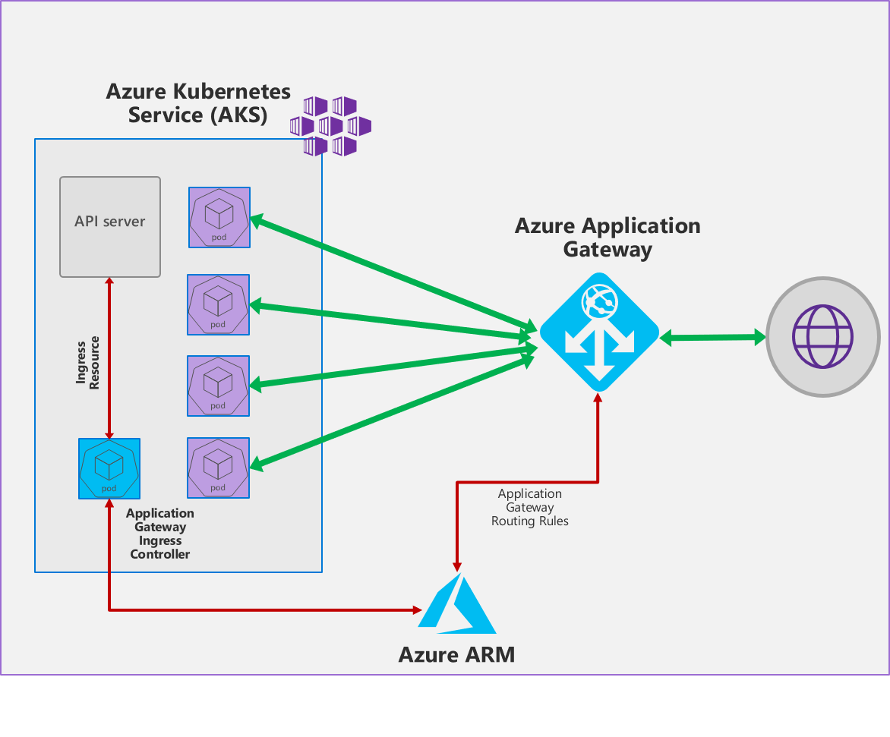

# Application Gateway Ingress Controller

Application Gateway Ingress Controller (AGIC) is a Kubernetes application, which makes it possible for [Azure Kubernetes Service (AKS)](https://azure.microsoft.com/en-us/services/kubernetes-service/) customers to leverage Azure's native [Application Gateway](https://azure.microsoft.com/en-us/services/application-gateway/) L7 load-balancer to expose cloud software to the Internet. AGIC monitors the Kubernetes cluster it is hosted on and continuously updates an App Gateway, so that selected services are exposed to the Internet.

The Ingress Controller runs in its own pod on the customer’s AKS. AGIC monitors a subset of Kubernetes Resources for changes. The state of the AKS cluster is translated to App Gateway  specific configuration and applied to the [Azure Resource Manager (ARM)](https://docs.microsoft.com/en-us/azure/azure-resource-manager/resource-group-overview).

AGIC is configured via the Kubernetes [Ingress resource](http://kubernetes.io/docs/user-guide/ingress/), along with Service and Deployments/Pods. It provides a number of features, leveraging Azure’s native App Gateway L7 load balancer. To name a few:
  - URL routing
  - Cookie-based affinity
  - SSL termination
  - End-to-end SSL
  - Support for public, private, and hybrid web sites
  - Integrated web application firewall

## Blogs and talks
- [Application Gateway Ingress Controller for Azure Kubernetes Service](https://azure.microsoft.com/en-us/blog/application-gateway-ingress-controller-for-azure-kubernetes-service/)
- [Ignite 2019 - AGIC GA announcement](https://myignite.techcommunity.microsoft.com/sessions/82945)

## Setup

- [**Greenfield Deployment**](docs/setup/install-new.md): Instructions on installing AGIC, AKS and App Gateway on
blank-slate infrastructure.

- [**Preview - Greenfield Deployment (Windows cluster)**](docs/setup/install-new-windows-cluster.md): Instructions on installing AGIC, AKS and App Gateway on
blank-slate infrastructure (running Windows Node Pool).

- [**Brownfield Deployment**](docs/setup/install-existing.md): Install AGIC on an existing AKS and Application Gateway.

## Usage

[**Tutorials**](docs/tutorials/tutorial.general.md): Refer to these to understand how you can expose an AKS service over HTTP or HTTPS, to the internet, using an Azure Application Gateway.

[**Features**](docs/features/): List of all available AGIC features.

[**Annotations**](docs/annotations.md): The Kubernetes Ingress specification does not allow all features of Application Gateway to be exposed through the ingress resource. Therefore we have introduced application gateway ingress controller specific annotations to expose application gateway features through an ingress resource. Please refer to these to understand the various annotations supported by the ingress controller, and the corresponding features that can be turned on in the application gateway for a given annotation.

[**Upgrade/Rollback AGIC using helm**](docs/how-tos/helm-upgrade.md): This documents explains how to upgrade/rollback AGIC helm installation.

## How-tos
* [Setup E2E SSL](docs/tutorials/tutorial.e2e-ssl.md)
* [Automate SSL Cert issuance and rotation with Let's Encrypt](docs/how-tos/lets-encrypt.md)
* [Expose a WebSocket server](docs/how-tos/websockets.md)
* [Automate DNS updates](docs/how-tos/dns.md)
* [Upgrade AGIC via Helm](docs/how-tos/helm-upgrade.md)
* [Scale your Applications using Application Gateway Metrics (Beta)](docs/how-tos/scale-applications-using-appgw-metrics.md)
* [Continuous Deployment with AKS and AGIC using Azure Pipelines](docs/how-tos/continuous-deployment.md)
* [Minimizing Downtime During Deployments](./docs/how-tos/minimize-downtime-during-deployments.md)

## Troubleshooting

For troubleshooting, please refer to this [guide](docs/troubleshooting.md).

## Frequently asked questions

For FAQ, please refer to this [guide](docs/faq.md).

## Reporting Issues

The best way to report an issue is to create a Github Issue for the project. Please include the following information when creating the issue:

- Subscription ID for AKS cluster.
- Subscription ID for Application Gateway.
- AKS cluster name/ARM Resource ID.
- Application Gateway name/ARM Resource ID.
- Ingress resource definition that might causing the problem.
- The Helm configuration used to install the ingress controller.

## Contributing

This is a Golang project. You can find the build instructions of the project in the [Developer Guide](docs/developers/build.md).

This project welcomes contributions and suggestions.  Most contributions require you to agree to a
Contributor License Agreement (CLA) declaring that you have the right to, and actually do, grant us
the rights to use your contribution. For details, visit <https://cla.microsoft.com>.

When you submit a pull request, a CLA-bot will automatically determine whether you need to provide
a CLA and decorate the PR appropriately (e.g., label, comment). Simply follow the instructions
provided by the bot. You will only need to do this once across all repos using our CLA.

This project has adopted the [Microsoft Open Source Code of Conduct](https://opensource.microsoft.com/codeofconduct/).
For more information see the [Code of Conduct FAQ](https://opensource.microsoft.com/codeofconduct/faq/) or
contact [opencode@microsoft.com](mailto:opencode@microsoft.com) with any additional questions or comments.
