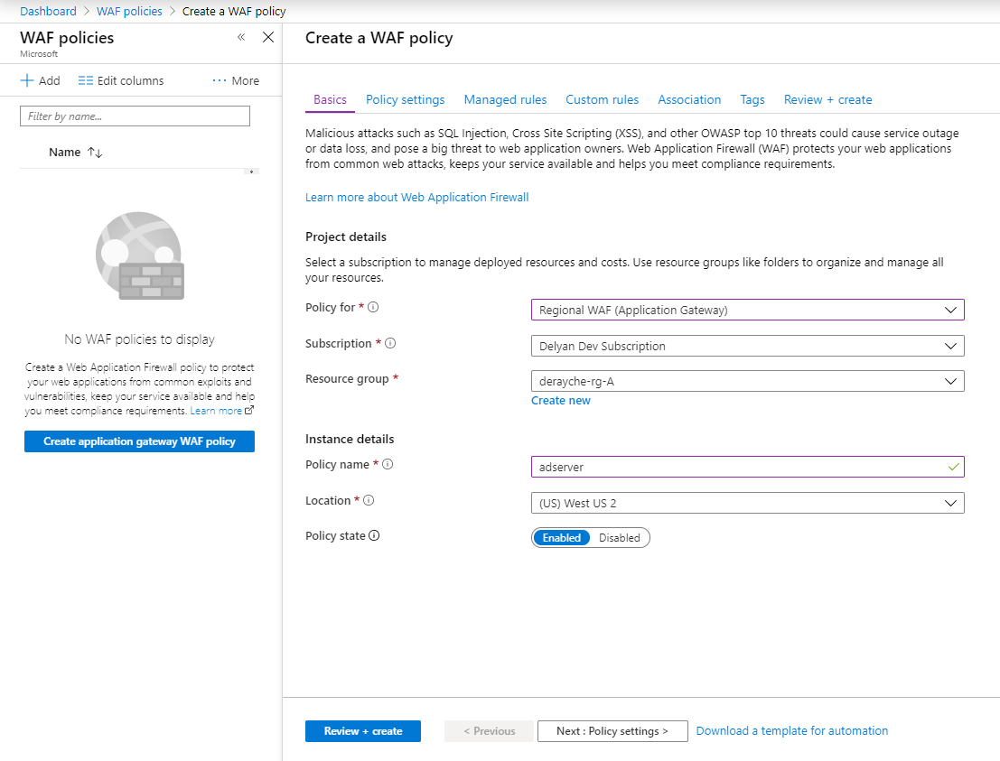
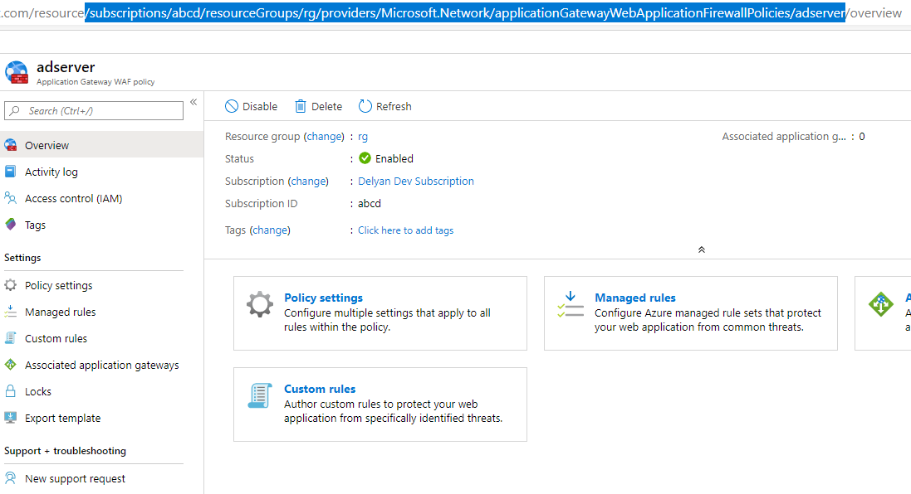

# Annotations

## Introductions

The Kubernetes Ingress resource can be annotated with arbitrary key/value pairs. AGIC relies on annotations to program Application Gateway features, which are not configurable via the Ingress YAML. Ingress annotations are applied to all HTTP setting, backend pools and listeners derived from an ingress resource.

## List of supported annotations

For an Ingress resource to be observed by AGIC it **must be annotated** with `kubernetes.io/ingress.class: azure/application-gateway`. Only then AGIC will work with the Ingress resource in question.

| Annotation Key | Value Type | Default Value | Allowed Values | Supported since |
| -- | -- | -- | -- | -- |
| [appgw.ingress.kubernetes.io/backend-path-prefix](#backend-path-prefix) | `string` | `nil` | | `1.3.0` |
| [appgw.ingress.kubernetes.io/backend-hostname](#backend-hostname) | `string` | `nil` | | `1.2.0` |
| [appgw.ingress.kubernetes.io/backend-protocol](#backend-protocol) | `string` | `http` | `http`, `https` | `1.0.0` |
| [appgw.ingress.kubernetes.io/ssl-redirect](#ssl-redirect) | `bool` | `false` | | `1.0.0` |
| [appgw.ingress.kubernetes.io/appgw-ssl-certificate](#appgw-ssl-certificate) | `string` | `nil` | | `1.2.0` |
| [appgw.ingress.kubernetes.io/appgw-trusted-root-certificate](#appgw-trusted-root-certificate) | `string` | `nil` | | `1.2.0` |
| [appgw.ingress.kubernetes.io/connection-draining](#connection-draining) | `bool` | `false` | | `1.0.0` |
| [appgw.ingress.kubernetes.io/connection-draining-timeout](#connection-draining) | `int32` (seconds) | `30` | | `1.0.0` |
| [appgw.ingress.kubernetes.io/cookie-based-affinity](#cookie-based-affinity) | `bool` | `false` | | `1.0.0` |
| [appgw.ingress.kubernetes.io/request-timeout](#request-timeout) | `int32` (seconds) | `30` | | `1.0.0` |
| [appgw.ingress.kubernetes.io/override-frontend-port](#override-frontend-port) | `string` |   |   | `1.3.0` |
| [appgw.ingress.kubernetes.io/use-private-ip](#use-private-ip) | `bool` | `false` | | `1.0.0` |
| [appgw.ingress.kubernetes.io/waf-policy-for-path](#azure-waf-policy-for-path) | `string` |   |   | `1.3.0` |
| [appgw.ingress.kubernetes.io/health-probe-hostname](#health-probe-hostname) | `string` |  `nil` |   | `1.4.0-rc1` |
| [appgw.ingress.kubernetes.io/health-probe-port](#health-probe-port) | `int32` | `nil`  |   | `1.4.0-rc1` |
| [appgw.ingress.kubernetes.io/health-probe-path](#health-probe-path) | `string` | `nil`  |   | `1.4.0-rc1` |
| [appgw.ingress.kubernetes.io/health-probe-status-codes](#health-probe-status-codes) | `[]string` | `nil`  |   | `1.4.0-rc1` |
| [appgw.ingress.kubernetes.io/health-probe-interval](#health-probe-interval) | `int32` | `nil`  |   | `1.4.0-rc1` |
| [appgw.ingress.kubernetes.io/health-probe-timeout](#health-probe-timeout) | `int32` | `nil`  |   | `1.4.0-rc1` |
| [appgw.ingress.kubernetes.io/health-probe-unhealthy-threshold](#health-probe-unhealthy-threshold) | `int32` | `nil`  |   | `1.4.0-rc1` |

## Override Frontend Port

The annotation allows to configure frontend listener to use different ports other than 80/443 for http/https.

If the port is within the App Gw authorized range (1 - 64999), this listener will be created on this specific port. If an invalid port or no port is set in the annotation, the configuration will fallback on default 80 or 443.

### Usage

```yaml
appgw.ingress.kubernetes.io/override-frontend-port: "port"
```

### Example

```yaml
apiVersion: networking.k8s.io/v1
kind: Ingress
metadata:
  name: go-server-ingress-overridefrontendport
  namespace: test-ag
  annotations:
    kubernetes.io/ingress.class: azure/application-gateway
    appgw.ingress.kubernetes.io/override-frontend-port: "8080"
spec:
  rules:
  - http:
      paths:
      - path: /hello/
        backend:
          service:
            name: go-server-service
            port:
              number: 80
        pathType: Exact
```

External request will need to target http://somehost:8080 instead of http://somehost.

## Backend Path Prefix

This annotation allows the backend path specified in an ingress resource to be re-written with prefix specified in this annotation. This allows users to expose services whose endpoints are different than endpoint names used to expose a service in an ingress resource.

### Usage

```yaml
appgw.ingress.kubernetes.io/backend-path-prefix: <path prefix>
```

### Example

```yaml
apiVersion: networking.k8s.io/v1
kind: Ingress
metadata:
  name: go-server-ingress-bkprefix
  namespace: test-ag
  annotations:
    kubernetes.io/ingress.class: azure/application-gateway
    appgw.ingress.kubernetes.io/backend-path-prefix: "/test/"
spec:
  rules:
  - http:
      paths:
      - path: /hello/
        backend:
          service:
            name: go-server-service
            port:
              number: 80
        pathType: Exact
```
In the example above we have defined an ingress resource named `go-server-ingress-bkprefix` with an annotation `appgw.ingress.kubernetes.io/backend-path-prefix: "/test/"` . The annotation tells application gateway to create an HTTP setting which will have a path prefix override for the path `/hello` to `/test/`.

***NOTE:*** In the above example we have only one rule defined. However, the annotations is applicable to the entire ingress resource so if a user had defined multiple rules the backend path prefix would be setup for each of the paths specified. Thus, if a user wants different rules with different path prefixes (even for the same service) they would need to define different ingress resources.

If your incoming path is /hello/test/health but your backend requires /health you will want to ensure you have /* on your path


```yaml
apiVersion: extensions/v1beta1
kind: Ingress
metadata:
  name: go-server-ingress-bkprefix
  namespace: test-ag
  annotations:
    kubernetes.io/ingress.class: azure/application-gateway
    appgw.ingress.kubernetes.io/backend-path-prefix: "/"
spec:
  rules:
  - http:
      paths:
      - path: /hello/test/*
        backend:
          serviceName: go-server-service
    

## Backend Hostname

This annotations allows us to specify the host name that Application Gateway should use while talking to the Pods.

### Usage
```yaml
appgw.ingress.kubernetes.io/backend-hostname: "internal.example.com"
```

### Example
```yaml
apiVersion: networking.k8s.io/v1
kind: Ingress
metadata:
  name: go-server-ingress-timeout
  namespace: test-ag
  annotations:
    kubernetes.io/ingress.class: azure/application-gateway
    appgw.ingress.kubernetes.io/backend-hostname: "internal.example.com"
spec:
  rules:
  - http:
      paths:
      - path: /hello/
        backend:
          service:
            name: go-server-service
            port:
              number: 80
        pathType: Exact
```

## Backend Protocol

This annotation allows us to specify the protocol that Application Gateway should use while talking to the Pods. Supported Protocols: `http`, `https`

> **Note**
1) Make sure to not use port 80 with HTTPS and port 443 with HTTP on the Pods.

### Usage
```yaml
appgw.ingress.kubernetes.io/backend-protocol: "https"
```

### Example
```yaml
apiVersion: networking.k8s.io/v1
kind: Ingress
metadata:
  name: go-server-ingress-timeout
  namespace: test-ag
  annotations:
    kubernetes.io/ingress.class: azure/application-gateway
    appgw.ingress.kubernetes.io/backend-protocol: "https"
spec:
  rules:
  - http:
      paths:
      - path: /hello/
        backend:
          service:
            name: go-server-service
            port:
              number: 443
        pathType: Exact
```

## SSL Redirect

Application Gateway [can be configured](https://docs.microsoft.com/en-us/azure/application-gateway/application-gateway-redirect-overview)
to automatically redirect HTTP URLs to their HTTPS counterparts. When this
annotation is present and TLS is properly configured, Kubernetes Ingress
controller will create a [routing rule with a redirection configuration](https://docs.microsoft.com/en-us/azure/application-gateway/redirect-http-to-https-portal#add-a-routing-rule-with-a-redirection-configuration)
and apply the changes to your App Gateway. The redirect created will be HTTP `301 Moved Permanently`.

### Usage

```yaml
appgw.ingress.kubernetes.io/ssl-redirect: "true"
```

### Example

```yaml
apiVersion: networking.k8s.io/v1
kind: Ingress
metadata:
  name: go-server-ingress-redirect
  namespace: test-ag
  annotations:
    kubernetes.io/ingress.class: azure/application-gateway
    appgw.ingress.kubernetes.io/ssl-redirect: "true"
spec:
  tls:
   - hosts:
     - www.contoso.com
     secretName: testsecret-tls
  rules:
  - host: www.contoso.com
    http:
      paths:
      - backend:
          service:
            name: websocket-repeater
            port:
              number: 80
```

## AppGw SSL Certificate

The SSL certificate [can be configured to Application Gateway](https://docs.microsoft.com/en-us/cli/azure/network/application-gateway/ssl-cert?view=azure-cli-latest#az-network-application-gateway-ssl-cert-create) either from a local PFX cerficate file or a reference to a Azure Key Vault unversioned secret Id.
When the annotation is present with a certificate name and the certificate is pre-installed in Application Gateway, Kubernetes Ingress controller will create a routing rule with a HTTPS listener and apply the changes to your App Gateway.
`appgw-ssl-certificate` annotation can also be used together with `ssl-redirect` annotation in case of SSL redirect.

Please refer to [appgw-ssl-certificate feature](features/appgw-ssl-certificate.md) for more details.

> **Note**
* Annotation "appgw-ssl-certificate" will be ignored when TLS Spec is defined in ingress at the same time.
* If a user wants different certs with different hosts(multi tls certificate termination), they would need to define different ingress resources.

### Use Azure CLI to install certificate to Application Gateway
* Configure from a local PFX certificate file
```bash
az network application-gateway ssl-cert create -g $resgp  --gateway-name $appgwName -n mysslcert --cert-file \path\to\cert\file --cert-password Abc123
```

* Configure from a reference to a Key Vault unversioned secret id
```bash
az keyvault certificate create --vault-name $vaultName -n cert1 -p "$(az keyvault certificate get-default-policy)"
versionedSecretId=$(az keyvault certificate show -n cert --vault-name $vaultName --query "sid" -o tsv)
unversionedSecretId=$(echo $versionedSecretId | cut -d'/' -f-5) # remove the version from the url
az network application-gateway ssl-cert create -n mysslcert --gateway-name $appgwName --resource-group $resgp --key-vault-secret-id $unversionedSecretId
```

To use PowerShell, please refer to [Configure Key Vault - PowerShell](https://docs.microsoft.com/en-us/azure/application-gateway/configure-keyvault-ps).

### Usage

```yaml
appgw.ingress.kubernetes.io/appgw-ssl-certificate: "name-of-appgw-installed-certificate"
```

### Example

```yaml
apiVersion: networking.k8s.io/v1
kind: Ingress
metadata:
  name: go-server-ingress-certificate
  namespace: test-ag
  annotations:
    kubernetes.io/ingress.class: azure/application-gateway
    appgw.ingress.kubernetes.io/appgw-ssl-certificate: "name-of-appgw-installed-certificate"
spec:
  rules:
  - host: www.contoso.com
    http:
      paths:
      - backend:
          service:
            name: websocket-repeater
            port:
              number: 80
```

## AppGW Trusted Root Certificate
Users now can [configure their own root certificates to Application Gateway](https://docs.microsoft.com/en-us/cli/azure/network/application-gateway/root-cert?view=azure-cli-latest) to be trusted via AGIC.
The annotaton `appgw-trusted-root-certificate` shall be used together with annotation `backend-protocol` to indicate end-to-end ssl encryption, multiple root certificates, separated by comma, if specified, e.g. "name-of-my-root-cert1,name-of-my-root-certificate2".

### Use Azure CLI to install your root certificate to Application Gateway
* Create your public root certificate for testing
```bash
openssl ecparam -out test.key -name prime256v1 -genkey
openssl req -new -sha256 -key test.key -out test.csr
openssl x509 -req -sha256 -days 365 -in test.csr -signkey test.key -out test.crt
```

* Configure your root certificate to Application Gateway
```bash
# Rename test.crt to test.cer
mv test.crt test.cer

# Configure the root certificate to your Application Gateway
az network application-gateway root-cert create --cert-file test.cer  --gateway-name $appgwName  --name name-of-my-root-cert1 --resource-group $resgp
```

* Repeat the steps above if you want to configure multiple trusted root certificates

### Usage

```yaml
appgw.ingress.kubernetes.io/backend-protocol: "https"
appgw.ingress.kubernetes.io/appgw-trusted-root-certificate: "name-of-my-root-cert1"
```

### Example

```yaml
apiVersion: networking.k8s.io/v1
kind: Ingress
metadata:
  name: go-server-ingress-certificate
  namespace: test-ag
  annotations:
    kubernetes.io/ingress.class: azure/application-gateway
    appgw.ingress.kubernetes.io/backend-protocol: "https"
    appgw.ingress.kubernetes.io/appgw-trusted-root-certificate: "name-of-my-root-cert1"
spec:
  rules:
  - host: www.contoso.com
    http:
      paths:
      - backend:
          service:
            name: websocket-repeater
            port:
              number: 80
```

## Connection Draining

`connection-draining`: This annotation allows to specify whether to enable connection draining.
`connection-draining-timeout`: This annotation allows to specify a timeout after which Application Gateway will terminate the requests to the draining backend endpoint.

### Usage

```yaml
appgw.ingress.kubernetes.io/connection-draining: "true"
appgw.ingress.kubernetes.io/connection-draining-timeout: "60"
```

### Example

```yaml
apiVersion: networking.k8s.io/v1
kind: Ingress
metadata:
  name: go-server-ingress-drain
  namespace: test-ag
  annotations:
    kubernetes.io/ingress.class: azure/application-gateway
    appgw.ingress.kubernetes.io/connection-draining: "true"
    appgw.ingress.kubernetes.io/connection-draining-timeout: "60"
spec:
  rules:
  - http:
      paths:
      - path: /hello/
        backend:
          service:
            name: go-server-service
            port:
              number: 80
        pathType: Exact
```

## Cookie Based Affinity

This annotation allows to specify whether to enable cookie based affinity.

### Usage

```yaml
appgw.ingress.kubernetes.io/cookie-based-affinity: "true"
```

### Example

```yaml
apiVersion: networking.k8s.io/v1
kind: Ingress
metadata:
  name: go-server-ingress-affinity
  namespace: test-ag
  annotations:
    kubernetes.io/ingress.class: azure/application-gateway
    appgw.ingress.kubernetes.io/cookie-based-affinity: "true"
spec:
  rules:
  - http:
      paths:
      - path: /hello/
        backend:
          service:
            name: go-server-service
            port:
              number: 80
        pathType: Exact
```
### distinct cookie name
In addition to cookie-based-affinity, you can set `cookie-based-affinity-distinct-name: "true"` to ensure a different affinity cookie is set per backend.
###

```yaml
appgw.ingress.kubernetes.io/cookie-based-affinity-distinct-name: "true"
```
### Example

```yaml
apiVersion: extensions/v1beta1
kind: Ingress
metadata:
  name: go-server-ingress-affinity
  namespace: test-ag
  annotations:
    kubernetes.io/ingress.class: azure/application-gateway
    appgw.ingress.kubernetes.io/cookie-based-affinity: "true"
    appgw.ingress.kubernetes.io/cookie-based-affinity-distinct-name: "true"
spec:
  rules:
  - http:
      paths:
      - path: /affinity1/
        backend:
          serviceName: affinity-service
          servicePort: 80
      - path: /affinity2/
        backend:
          serviceName: other-affinity-service
          servicePort: 80          
```

## Request Timeout

This annotation allows to specify the request timeout in seconds after which Application Gateway will fail the request if response is not received.

### Usage

```yaml
appgw.ingress.kubernetes.io/request-timeout: "20"
```

### Example

```yaml
apiVersion: networking.k8s.io/v1
kind: Ingress
metadata:
  name: go-server-ingress-timeout
  namespace: test-ag
  annotations:
    kubernetes.io/ingress.class: azure/application-gateway
    appgw.ingress.kubernetes.io/request-timeout: "20"
spec:
  rules:
  - http:
      paths:
      - path: /hello/
        backend:
          service:
            name: go-server-service
            port:
              number: 80
        pathType: Exact
```

## Use Private IP

This annotation allows us to specify whether to expose this endpoint on Private IP of Application Gateway.

> **Note**
1) App Gateway doesn't support multiple IPs on the same port (example: 80/443). Ingress with annotation `appgw.ingress.kubernetes.io/use-private-ip: "false"` and another with `appgw.ingress.kubernetes.io/use-private-ip: "true"` on `HTTP` will cause AGIC to fail in updating the App Gateway.
2) For App Gateway that doesn't have a private IP, Ingresses with `appgw.ingress.kubernetes.io/use-private-ip: "true"` will be ignored. This will reflected in the controller logs and ingress events for those ingresses with `NoPrivateIP` warning.


### Usage
```yaml
appgw.ingress.kubernetes.io/use-private-ip: "true"
```

### Example
```yaml
apiVersion: networking.k8s.io/v1
kind: Ingress
metadata:
  name: go-server-ingress-timeout
  namespace: test-ag
  annotations:
    kubernetes.io/ingress.class: azure/application-gateway
    appgw.ingress.kubernetes.io/use-private-ip: "true"
spec:
  rules:
  - http:
      paths:
      - path: /hello/
        backend:
          service:
            name: go-server-service
            port:
              number: 80
        pathType: Exact
```

## Azure Waf Policy For Path
This annotation allows you to attach an already created WAF policy to the list paths for a host within a Kubernetes
Ingress resource being annotated.

The WAF policy must be created in advance. Example of using [Azure Portal](https://portal.azure.com/) to create a policy:


Once the policy is created, copy the URI of the policy from the address bar of Azure Portal:


The URI would have the following format:
```bash
/subscriptions/<YOUR-SUBSCRIPTION>/resourceGroups/<YOUR-RESOURCE-GROUP>/providers/Microsoft.Network/applicationGatewayWebApplicationFirewallPolicies/<YOUR-POLICY-NAME>
```
> **Note**
1) Waf policy will only be applied to a listener if ingress rule path is not set or set to "/" or "/*"

### Usage

```yaml
appgw.ingress.kubernetes.io/waf-policy-for-path: "/subscriptions/abcd/resourceGroups/rg/providers/Microsoft.Network/applicationGatewayWebApplicationFirewallPolicies/adserver"
```

### Example
The example below will apply the WAF policy
```yaml
apiVersion: networking.k8s.io/v1
kind: Ingress
metadata:
  name: ad-server-ingress
  namespace: commerce
  annotations:
    kubernetes.io/ingress.class: azure/application-gateway
    appgw.ingress.kubernetes.io/waf-policy-for-path: "/subscriptions/abcd/resourceGroups/rg/providers/Microsoft.Network/applicationGatewayWebApplicationFirewallPolicies/adserver"
spec:
  rules:
  - http:
      paths:
      - path: /ad-server
        backend:
          service:
            name: ad-server
            port:
              number: 80
        pathType: Exact
      - path: /auth
        backend:
          service:
            name: auth-server
            port:
              number: 80
        pathType: Exact
```
Note that the WAF policy will be applied to both `/ad-server` and `/auth` URLs.

## Health Probe Hostname

This annotation allows specifically define a target host to be used for AGW health probe. By default, if backend container running service with liveliness probe of type `HTTP GET` defined, host used in liveliness probe definition is also used as a target host for health probe. However if annotation `appgw.ingress.kubernetes.io/health-probe-hostname` is defined it overrides it with its own value.

### Usage

```yaml
appgw.ingress.kubernetes.io/health-probe-hostname: <hostname>
```

### Example

```yaml
apiVersion: networking.k8s.io/v1
kind: Ingress
metadata:
  name: go-server-ingress-bkprefix
  namespace: test-ag
  annotations:
    kubernetes.io/ingress.class: azure/application-gateway
    appgw.ingress.kubernetes.io/health-probe-hostname: "my-backend-host.custom.app"
spec:
  rules:
  - http:
      paths:
      - path: /hello/
        backend:
          service:
            name: go-server-service
            port:
              number: 80
        pathType: Exact
```

## Health Probe Port

Health probe port annotation allows specifically define target TCP port to be used for AGW health probe. By default, if backend container running service has liveliness probe of type `HTTP GET` defined, port used in liveliness probe definition is also used as a port for health probe. Annotation `appgw.ingress.kubernetes.io/health-probe-port` has precedence over such default value.

### Usage

```yaml
appgw.ingress.kubernetes.io/health-probe-port: <port number>
```

### Example

```yaml
apiVersion: networking.k8s.io/v1
kind: Ingress
metadata:
  name: go-server-ingress-bkprefix
  namespace: test-ag
  annotations:
    kubernetes.io/ingress.class: azure/application-gateway
    appgw.ingress.kubernetes.io/health-probe-hostname: "my-backend-host.custom.app"
    appgw.ingress.kubernetes.io/health-probe-port: "443"
    appgw.ingress.kubernetes.io/health-probe-path: "/healthz"
    appgw.ingress.kubernetes.io/backend-protocol: https
spec:
  tls:
    - secretName: "my-backend-host.custom.app-ssl-certificate"
  rules:
  - http:
      paths:
      - path: /
        backend:
          service:
            name: go-server-service
            port:
              number: 443
        pathType: Exact
```

## Health Probe Path

This annotation allows specifically define target URI path to be used for AGW health probe. By default, if backend container running service with liveliness probe of type `HTTP GET` defined , path defined in liveliness probe definition is also used as a path for health probe. However annotation `appgw.ingress.kubernetes.io/health-probe-path` overrides it with its own value.

### Usage

```yaml
appgw.ingress.kubernetes.io/health-probe-path: <URI path>
```

### Example

```yaml
apiVersion: networking.k8s.io/v1
kind: Ingress
metadata:
  name: go-server-ingress-bkprefix
  namespace: test-ag
  annotations:
    kubernetes.io/ingress.class: azure/application-gateway
    appgw.ingress.kubernetes.io/health-probe-hostname: "my-backend-host.custom.app"
    appgw.ingress.kubernetes.io/health-probe-port: "8080"
    appgw.ingress.kubernetes.io/health-probe-path: "/healthz"
spec:
  rules:
  - http:
      paths:
      - path: /
        backend:
          service:
            name: go-server-service
            port:
              number: 8080
```

## Health Probe Status Codes

This annotation defines healthy status codes returned by the health probe. The values are comma separated list of individual status codes or ranges defined as `<start of the range>-<end of the range>`.

### Usage

```yaml
appgw.ingress.kubernetes.io/health-probe-status-codes: <status codes>
```

### Example

```yaml
apiVersion: networking.k8s.io/v1
kind: Ingress
metadata:
  name: go-server-ingress-bkprefix
  namespace: test-ag
  annotations:
    kubernetes.io/ingress.class: azure/application-gateway
    appgw.ingress.kubernetes.io/health-probe-status-codes: "200-399, 401"
spec:
  rules:
  - http:
      paths:
      - path: /
        backend:
          service:
            name: go-server-service
            port:
              number: 8080
        pathType: Exact
```

## Health Probe Interval

This annotation sets AGW health probe interval. By default, if backend container running service with liveliness probe of type `HTTP GET` defined, interval in liveliness probe definition is also used as a interval for health probe. However annotation `appgw.ingress.kubernetes.io/health-probe-interval` overrides it with its value.

### Usage

```yaml
appgw.ingress.kubernetes.io/health-probe-interval: <interval seconds>
```

### Example

```yaml
apiVersion: networking.k8s.io/v1
kind: Ingress
metadata:
  name: go-server-ingress-bkprefix
  namespace: test-ag
  annotations:
    kubernetes.io/ingress.class: azure/application-gateway
    appgw.ingress.kubernetes.io/health-probe-interval: "20"
spec:
  rules:
  - http:
      paths:
      - path: /
        backend:
          service:
            name: go-server-service
            port:
              number: 8080
        pathType: Exact
```

## Health Probe Timeout

This annotation allows specifically define timeout for AGW health probe. By default, if backend container running service with liveliness probe of type `HTTP GET` defined, timeout defined in liveliness probe definition is also used for health probe. However annotation `appgw.ingress.kubernetes.io/health-probe-timeout` overrides it with its value.

### Usage

```yaml
appgw.ingress.kubernetes.io/health-probe-timeout: <timeout seconds>
```

### Example

```yaml
apiVersion: networking.k8s.io/v1
kind: Ingress
metadata:
  name: go-server-ingress-bkprefix
  namespace: test-ag
  annotations:
    kubernetes.io/ingress.class: azure/application-gateway
    appgw.ingress.kubernetes.io/health-probe-timeout: "15"
spec:
  rules:
  - http:
      paths:
      - path: /
        backend:
          service:
            name: go-server-service
            port:
              number: 8080
        pathType: Exact
```

## Health Probe Unhealthy Threshold

This annotation allows specifically define target unhealthy thresold for AGW health probe. By default, if backend container running service with liveliness probe of type `HTTP GET` defined , threshold defined in liveliness probe definition is also used for health probe. However annotation `appgw.ingress.kubernetes.io/health-probe-unhealthy-threshold` overrides it with its value.

### Usage

```yaml
appgw.ingress.kubernetes.io/health-probe-unhealthy-threshold: <unhealthy threshold>
```

### Example

```yaml
apiVersion: networking.k8s.io/v1
kind: Ingress
metadata:
  name: go-server-ingress-bkprefix
  namespace: test-ag
  annotations:
    kubernetes.io/ingress.class: azure/application-gateway
    appgw.ingress.kubernetes.io/health-probe-unhealthy-threshold: "5"
spec:
  rules:
  - http:
      paths:
      - path: /
        backend:
          service:
            name: go-server-service
            port:
              number: 8080
        pathType: Exact
```
