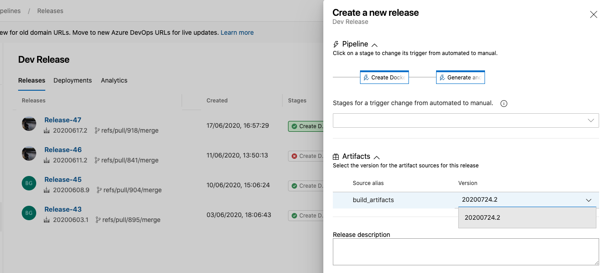
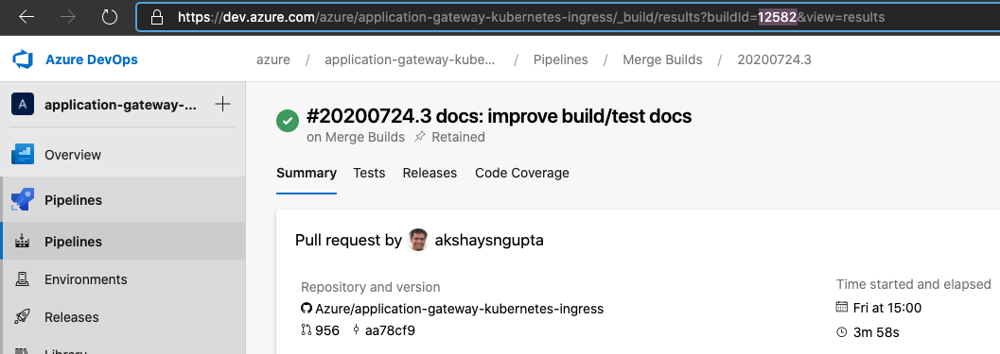

# Building the controller

* [Running it locally](#running-it-locally)
  * [Pre-requisite](#pre-requisite)
  * [Obtain Azure Credentials](#obtain-azure-credentials)
  * [Deploy Application Gateway and AKS](#deploy-application-gateway-and-aks)
  * [Using startup script](#using-startup-script)
  * [Visual Studio Code (F5 debugging)](#visual-studio-code-f5-debugging)
* [Run on a cluster using a Dev Release](#create-a-dev-release)
* [CMake options](#cmake-options)

## Running it locally

This section outlines the environment variables and files necessary to successfully compile and run the Go binary, then connect it to an [Azure Kubernetes Service](https://docs.microsoft.com/en-us/azure/aks/intro-kubernetes).

### Pre-requisite

* [go >= 1.13](https://golang.org/dl/)
* OpenSSL

### Obtain Azure Credentials

In order to run the Go binary locally and control a remote AKS server, you need Azure credentials. These will be stored in a JSON file in your home directory.

Follow [these instructions](https://docs.microsoft.com/en-us/dotnet/api/overview/azure/containerinstance?view=azure-dotnet#authentication) to create the `$HOME/.azure/azureAuth.json` file. The file is generated via:

```bash
az ad sp create-for-rbac --sdk-auth > $HOME/.azure/azureAuth.json
```

The file will contain a JSON blob with the following shape:

```json
{
  "clientId": "...",
  "clientSecret": "...",
  "subscriptionId": "<your-azure-subscription-id>",
  "tenantId": "...",
  "activeDirectoryEndpointUrl": "https://login.microsoftonline.com",
  "resourceManagerEndpointUrl": "https://management.azure.com/",
  "activeDirectoryGraphResourceId": "https://graph.windows.net/",
  "sqlManagementEndpointUrl": "https://management.core.windows.net:8443/",
  "galleryEndpointUrl": "https://gallery.azure.com/",
  "managementEndpointUrl": "https://management.core.windows.net/"
}
```

### Deploy Application Gateway and AKS

To deploy a fresh setup, please follow the steps for template deployment in the [greenfield](../setup/install.md) documentation.

### Using startup script

In the `scripts` directory you will find `start.sh`. This script builds and runs the ingress controller on your local machine and connects to a remote AKS cluster. A `.env` file in the root of the repository is required.

Steps to run ingress controller:

1. Get your cluster's credentials

    ```
    az aks get-credentials --name <cluster-name> --resource-group <group>
    ```

1. Configure: `cp .env.example .env` and modify the environment variables in `.env` to match your config. Here is an example:

    ```
    #!/bin/bash
    export AZURE_AUTH_LOCATION="$HOME/.azure/azureAuth.json"

    export APPGW_RESOURCE_ID="<gateway-resource-id>"

    export KUBE_CONFIG_FILE="$HOME/.kube/config"

    export APPGW_VERBOSITY_LEVEL="9"
    ```

1. Run: `./scripts/start.sh`

    ```
    Cleanup: delete /home/vsonline/go/src/github.com/Azure/application-gateway-kubernetes-ingress/bin
    Compiling...
    Build SUCCEEDED
    ERROR: logging before flag.Parse: I0723 18:37:31.980903    6757 utils.go:115] Using verbosity level 9 from environment variable APPGW_VERBOSITY_LEVEL
    Version: 1.2.0; Commit: ef716c14; Date: 2020-07-23-18:37T+0000
    ERROR: logging before flag.Parse: I0723 18:37:31.989656    6766 utils.go:115] Using verbosity level 9 from environment variable APPGW_VERBOSITY_LEVEL
    ERROR: logging before flag.Parse: I0723 18:37:31.989720    6766 main.go:78] Unable to load cloud provider config ''. Error: Reading Az Context file "" failed: open : no such file or directory
    E0723 18:37:31.999445    6766 context.go:210] Error fetching AGIC Pod (This may happen if AGIC is running in a test environment). Error: resource name may not be empty
    I0723 18:37:31.999466    6766 environment.go:240] KUBERNETES_WATCHNAMESPACE is not set. Watching all available namespaces.
    ...
    ```

### Visual Studio Code (F5 debugging)

You can also setup vscode to run the project with `F5` and use breakpoint debugging. For this, you need to setup your `launch.json` file within `.vscode` folder.

```json
{
    "version": "0.2.0",
    "configurations": [
        {
            "name": "Debug",
            "type": "go",
            "request": "launch",
            "mode": "debug",
            "program": "${workspaceFolder}/cmd/appgw-ingress",
            "env": {
                "APPGW_VERBOSITY_LEVEL": "9",
                "AZURE_AUTH_LOCATION": "/home/<user>/.azure/azureAuth.json",
                "APPGW_RESOURCE_ID": "<gateway-resource-id>"
            },
            "args": [
                "--kubeconfig=/home/<user>/.kube/config",
                "--in-cluster=false"
            ]
        }
    ]
}
```

## Create a Dev Release

To test your changes on a cluster, you can use the [`Dev Release`](https://dev.azure.com/azure/application-gateway-kubernetes-ingress/_release?_a=releases&view=mine&definitionId=12) pipeline. Just select the build version from the drop-down list which matches the build in your PR or against your commit in the main branch.



`Dev Release` generates a new docker image and helm package for your changes. Once the pipeline completes, use helm to install the release on your AKS cluster.

```bash
# install/upgrade
helm install ingress-azure \
      -f helm-config.yaml \
      oci://mcr.microsoft.com/azure-application-gateway/charts/ingress-azure \
      --version 1.7.5
```

You can also find the `version` by opening your build in the `Merge Builds` pipeline and looking for the `buildid`. Use this version when installing on the cluster after the `Dev Release` completes.


## CMake options

This is a CMake-based project. Build targets include:

* `ALL_BUILD` (default target) builds `appgw-ingress` and `dockerize` target
* `devenv` builds a docker image with configured development environment
* `vendor` installs dependency using `go mod` in a docker container with image from `devenv` target
* `appgw-ingress` builds the binary for this controller in a docker container with image from `devenv` target
* `dockerize` builds a docker image with the binary from `appgw-ingress` target
* `dockerpush` pushes the docker image to a container registry with prefix defined in CMake variable `<deployment_push_prefix>`

To run the CMake targets:

1. `mkdir build && cd build` creates and enters a build directory
2. `cmake ..` generates project configuration in the build directory
3. `cmake --build .` to build the default target,
    or `cmake --build . --target <target_name>` to specify a target to run from above
