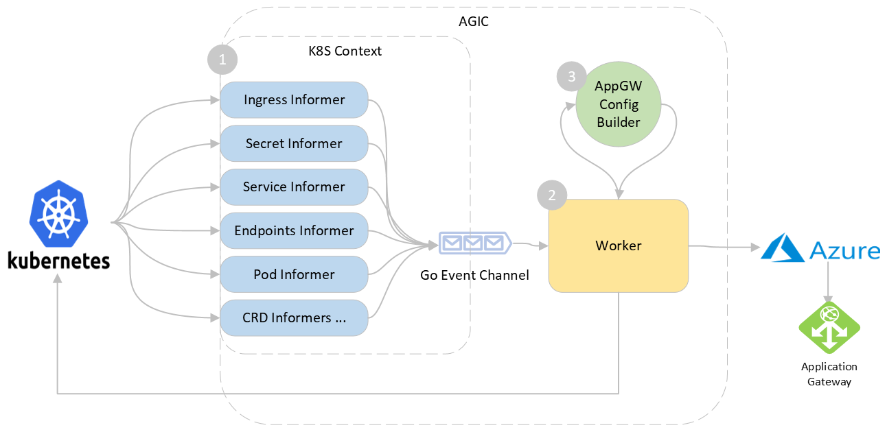

# Application Gateway Ingress Controller Design (WIP)

## Document Purpose

This document is the detailed design and architecture of the Application Gateway Ingress Controller (AGIC) being built in this repository.


## Overview

Application Gateway Ingress Controller (AGIC) is a Kubernetes application, which makes it possible for [Azure Kubernetes Service (AKS)](https://azure.microsoft.com/en-us/services/kubernetes-service/) customers to leverage Azure's native [Application Gateway](https://azure.microsoft.com/en-us/services/application-gateway/) L7 load-balancer to expose cloud software to the Internet. AGIC monitors the Kubernetes cluster it is hosted on and continuously updates an App Gateway, so that selected services are exposed to the Internet.

The Ingress Controller runs in its own pod on the customer’s AKS. AGIC monitors a subset of Kubernetes Resources for changes. The state of the AKS cluster is translated to App Gateway  specific configuration and applied to the [Azure Resource Manager (ARM)](https://docs.microsoft.com/en-us/azure/azure-resource-manager/resource-group-overview).


## High-level architecture

The AGIC is composed of the following three sub components:
  1. [K8S Context and Informers](#1-k8s-context-and-informers) - handles events from the cluster and alerts the worker
  2. [Worker](#2-worker) - handles events coming from the informer and perform relevant actions
  3. [Application Gateway Config Builder](#3-application-gateway-config-builder) -  generates the new gateway configuration




## Components

Let's take a look at each component:

### 1. K8s Context and Informers
When any change is applied the k8s cluster by the user, AGIC needs to listen to these changes in order to update the corresponding configuration on the Application Gateway.
We use the kubernetes informers for this purpose which is a standard for watching resources on the K8S API server.

When AGIC starts, it [setups up informers](../pkg/k8scontext/context.go) for watching following resources:
1. [Ingress](https://kubernetes.io/docs/concepts/services-networking/ingress/): This is the top-level resource that AGIC monitors. It provides information about the layer-7 routing rules that need to be configured on the App Gateway.
1. [Service](https://kubernetes.io/docs/concepts/services-networking/service/): Service provides an abstraction over the pods to expose as a network service. AGIC uses the service as logical grouping of pods to extract the IP addresses through the endpoints object created automatically along with the Service.
1. [Endpoints](https://kubernetes.io/docs/concepts/services-networking/endpoint-slices/): Endpoints provides information about Pod IP Addresses behind a service and is used to populate AppGW's backend pool.
1. [Pod](https://kubernetes.io/docs/concepts/workloads/pods/): Pod provides information about liveness and readiness probes which translated to health probe in App Gateway. AGIC only supports HTTP based liveness and readiness probe.
1. [Secret](https://kubernetes.io/docs/concepts/configuration/secret/): This resource is for extracting SSL certificates when referenced in an ingress. This also triggeres a change when the secret is updated.
1. [CRDs](https://kubernetes.io/docs/concepts/extend-kubernetes/api-extension/custom-resources/): AGIC has some custom resources for supporting specific features like prohibited target for sharing a gateway.

When starting the informers, AGIC also provides event handlers for each for create/update/delete operations on the resource. This handler is responsible for enqueuing an event .

### 2. Worker
[Worker](../../pkg/worker.go) is responsible for processing the events and performing updates.

When Worker's `Run` function is called, it starts as a separate thread and waits on the `Work` channel. When an informers add an event to the channel, worker dequeues the event and checks whether the event is noise or is relevant. Events that are coming from unwatched namespaces and unreferenced pods/endpoints are skipped to reduce the churn. If the the last worker loop was run less than 1 second ago, it sleeps for the remainder and wakes up to space out the updates.  
After this, worker starts draining the rest of the events and calling the `ProcessEvent` function to process the event.

`ProcessEvent` function does the following:
1. Check if the Application Gateway is in `Running` or `Starting` operational state.
1. Updates all ingress resources with public/private IP address of the App Gateway.
1. Generate new config and update the Application Gateway.

### 3. Application Gateway Config Builder
This [component](../../pkg/appgw/configbuilder.go) is responsible for using the information in the local kubernetes cache and generating the corresponding Application Gateway configuration as an output.

Worker invokes the `Build` on this component which then generates various gateways sub-resources starting from leaf sub-resources like `probes`, `http settings` up to the `request routing rules`.

```go
func (c *appGwConfigBuilder) Build(cbCtx *ConfigBuilderContext) (*n.ApplicationGateway, error) {
...
  err := c.HealthProbesCollection(cbCtx)
...
  err = c.BackendHTTPSettingsCollection(cbCtx)
...
  err = c.BackendAddressPools(cbCtx)
...
  // generates SSL certificate, frontend ports and http listeners
  err = c.Listeners(cbCtx)
...
  // generates URL path maps and request routing rules
  err = c.RequestRoutingRules(cbCtx)
...
  return &c.appGw, nil
}
```