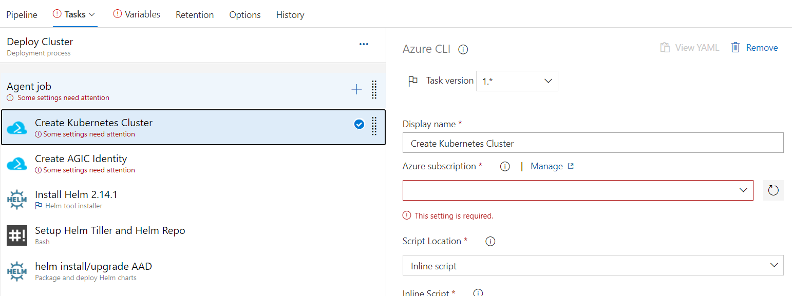

# Continuous Deployment with AKS and AGIC using Azure Pipelines

To achieve an efficiently deployed and managed global infrastucture, it is important to setup workflows for continuous integration and deployment. `Azure Devops` is one of the options to achieve this goal.

In following example, we setup a Azure Devops release pipeline to deploy an AKS cluster along with AGIC as ingress. This example is merely a scaffolding. You need to separately setup a build pipeline to install your application and ingress on the AKS cluster deployed as part of the release.

## Setup up new service connection with service principal

> **Note**: Skip if already have service connection with owner access for role assigment

1. Create a service principal to use with Azure Pipelines. This service principal will have owner access to current subscription. Access will be used to perform role assigement for AGIC identity in the pipeline.

    ```bash
    az ad sp create-for-rbac -n azure-pipeline-cd --role owner
    # Copy the AppId and Password. We will use these in the next step.
    ```

1. Now, create a [new service connection](https://docs.microsoft.com/en-us/azure/devops/pipelines/library/service-endpoints?view=azure-devops&tabs=yaml#create-a-service-connection) in Azure Devops. Select "*use the full version of the service connection dialog*" option so that you can provide the newly created service principal.


## Create a new Azure release pipeline

We have prepared an [example release pipeline](./continuous-deployment-pipeline.json). This pipeline has following tasks:
1. Deploy AKS Cluster
1. Create a user assigned identity used by AGIC Pod
1. Install Helm
1. Install AAD Pod identity
1. Install AGIC
1. Install a [sample application (with ingress)](https://raw.githubusercontent.com/Azure/application-gateway-kubernetes-ingress/aksgupta/cd/docs/examples/aspnetapp.yaml)  


To use the example release pipeline,
1. Download the [template](./continuous-deployment-pipeline.json) and import it to your project's release pipeline.

1. Now provide the required settings for all tasks:
    1. Select the correct `Agent Pool`
    
    1. Select the newly created service connection for the `Create Kubernetes Cluster` and `Create AGIC Identity` tasks.
    
    1. Provide the values for `clientId` and `clientSecret` that will be configured as cluster credentials for the AKS cluster. You should create a separate service principal for the AKS cluster for security reasons.
        ```bash
        # create a new one and copy the appId and password to the variable section in the pipeline
        az ad sp create-for-rbac -n aks-cluster
        ```
        

1. Click `Save`. Now your pipeline is all set up.

Hit `Create release` and provide a location(Azure region) where you want the cluster to be deployed.  


Snapshot of how the AKS node resource group will look:  


If this is your first deployment, AGIC will create a new application gateway. You should be able to visit the Application Gateway's ip address to visit the sample application.  
