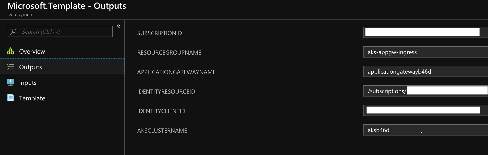

# Table of Contents
- [Deploying the infrastructure on Azure](#deploying-the-infrastructure-on-azure)
- [Setting up Application Gateway Ingress Controller on AKS](#setting-up-application-gateway-ingress-controller-on-aks)

## Deploying the infrastructure on Azure

To create the pre-requisite Azure resources, you can use the following template. It creates:
1) Azure Virtual Network with 2 subnets.
2) Azure Application Gateway v2.
3) Azure Kubernetes Service cluster with required permission to deploy nodes in the Virtual Network. You have an option to deploy RBAC enabled AKS cluster
4) User Assigned Identity to initialize the aad-pod-identity service and ingress controller.
5) Set required RBACs.


Steps:

1) Create a service principal that will be assigned to the AKS cluster in the template.
    ```bash
    az ad sp create-for-rbac --skip-assignment
    az ad sp show --id <appId> --query "objectId"
    ```
    **Note the appId, password and objectId.**

2) After creating the service principal in the step above, click to create a custom template deployment. Provide the appId for servicePrincipalClientId, password and objectId in the parameters.
    Note: For deploying an *RBAC* enabled cluster, set `aksEnabledRBAC` parameter to `true`.

    <a href="https://portal.azure.com/#create/Microsoft.Template/uri/https%3A%2F%2Fraw.githubusercontent.com%2FAzure%2Fapplication-gateway-kubernetes-ingress%2Fmaster%2Fdeploy%2Fazuredeploy.json" target="_blank">
        
    </a>
    <a href="http://armviz.io/#/?load=https%3A%2F%2Fraw.githubusercontent.com%2FAzure%2Fapplication-gateway-kubernetes-ingress%2Fmaster%2Fdeploy%2Fazuredeploy.json" target="_blank">
        
    </a>

    After the deployment completes, you can look at the Output window for parameters needed in the following steps.

    Example:
    

## Setting up Application Gateway Ingress Controller on AKS

Once, we have the created the resources in Azure, we need to deploy following controllers on the cluster:
1) `aad pod identity` - This controller uses user assigned identity and provide ARM access token to the controller.
2) `application gateway ingress controller` - This controller communicates ingress related events to the Application Gateway resource.

Steps:

1) To configure kubectl to connect to the deployed Azure Kubernetes Cluster, follow these [instructions](https://docs.microsoft.com/en-us/azure/aks/kubernetes-walkthrough#connect-to-the-cluster).

2) Add aad pod identity service to the cluster using the following command. This service will be used by the ingress controller. You can refer [aad-pod-identity](https://github.com/Azure/aad-pod-identity) for more information.  
    * *RBAC disabled* AKS cluster -
    ```bash
    kubectl create -f https://raw.githubusercontent.com/Azure/aad-pod-identity/master/deploy/infra/deployment.yaml
    ```

    * *RBAC enabled* AKS cluster -
    ```bash
    kubectl create -f https://raw.githubusercontent.com/Azure/aad-pod-identity/master/deploy/infra/deployment-rbac.yaml
    ```

3) Install [Helm](https://docs.microsoft.com/en-us/azure/aks/kubernetes-helm) and run the following to add `application-gateway-kubernetes-ingress` helm package:

    * *RBAC disabled* AKS cluster -
    ```bash
    helm init
    helm repo add application-gateway-kubernetes-ingress https://azure.github.io/application-gateway-kubernetes-ingress/helm/
    helm repo update
    ```

    * *RBAC enabled* AKS cluster -
    ```bash
    kubectl create serviceaccount --namespace kube-system tiller-sa
    kubectl create clusterrolebinding tiller-cluster-rule --clusterrole=cluster-admin --serviceaccount=kube-system:tiller-sa
    helm init --tiller-namespace kube-system --service-account tiller-sa
    helm repo add application-gateway-kubernetes-ingress https://azure.github.io/application-gateway-kubernetes-ingress/helm/
    helm repo update
    ```

4) Edit [helm-config.yaml](example/helm-config.yaml) and fill in the values for `appgw` and `armAuth`
    ```yaml
    # This file contains the essential configs for the ingress controller helm chart

    ################################################################################
    # Specify which application gateway the ingress controller will manage
    #
    appgw:
        subscriptionId: <subscription-id>
        resourceGroup: <resourcegroup-name>
        name: <applicationgateway-name>

    ################################################################################
    # Specify which kubernetes namespace the ingress controller will watch
    # Default value is "default"
    #
    # kubernetes:
    #   watchNamespace: <namespace>

    ################################################################################
    # Specify the authentication with Azure Resource Manager
    #
    # Two authentication methods are available:
    # - Option 1: AAD-Pod-Identity (https://github.com/Azure/aad-pod-identity)
    armAuth:
        type: aadPodIdentity
        identityResourceID: <identity-resource-id>
        identityClientID:  <identity-client-id>

    ################################################################################
    # Specify if the cluster is RBAC enabled or not
    rbac:
        enabled: false # true/false

    ################################################################################
    # Specify aks cluster related information
    aksClusterConfiguration:
        apiServerAddress: <aks-api-server-address>
    ```
    **NOTE:** The `<identity-resource-id>` and `<identity-client-id>` are the properties of the Azure AD Identity you setup in the previous section. You can retrieve this information by running the following command:  
        ```bash
        az identity show -g <resourcegroup> -n <identity-name>
        ```  
        Where `<resourcegroup>` is the resource group in which the top level AKS cluster object, Application Gateway and Managed Identify are deployed.

    Then execute the following to the install the Application Gateway ingress controller package.  
    ```bash
    helm install -f helm-config.yaml application-gateway-kubernetes-ingress/ingress-azure
    ```

Refer to the [tutorials](tutorial.md) to understand how you can expose an AKS service over HTTP or HTTPS, to the internet, using an Azure Application Gateway.
