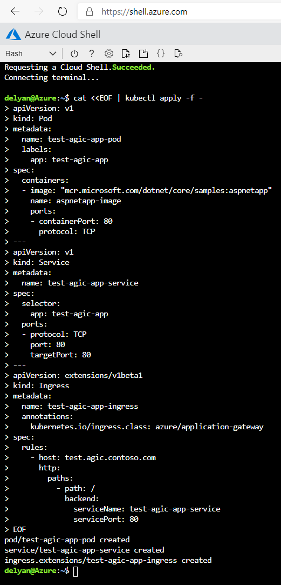
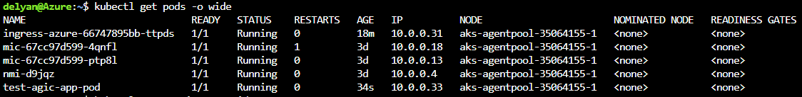
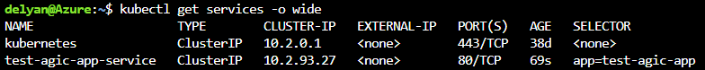
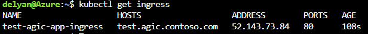
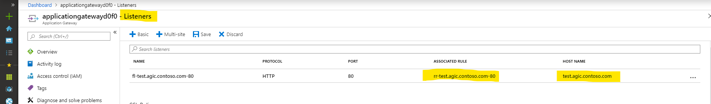
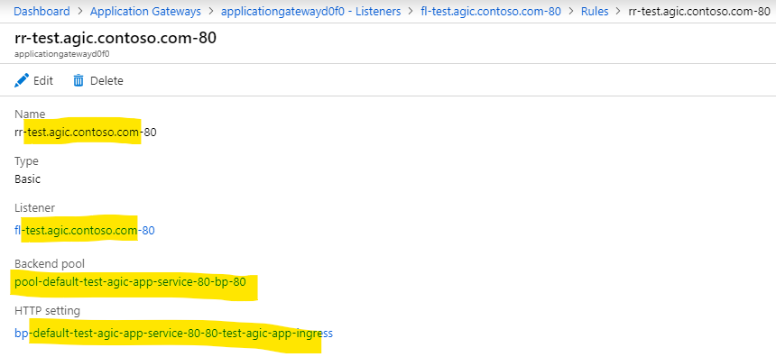
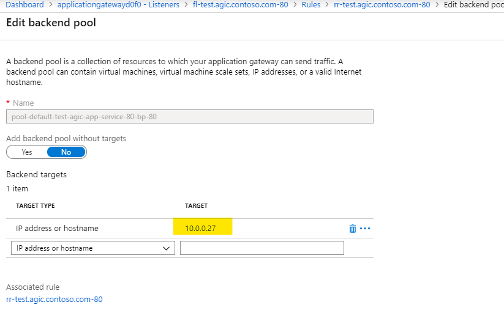
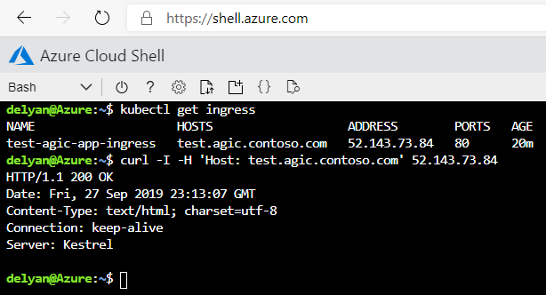

# Troubleshooting Guide

1. [Troubleshooting by installing a simple application](#troubleshooting-installing-a-simple-application)
1. [Troubleshooting issues related to AGIC pod not coming up](#troubleshooting-agic-pod-stuck-in-not-ready-state)

---
## Troubleshooting: Installing a simple application

[Azure Cloud Shell](https://shell.azure.com/) is the most convenient way to troubleshoot any problems with your AKS
and AGIC installation. Launch your shell from [shell.azure.com](https://shell.azure.com/) or by clicking the link:

[](https://shell.azure.com)

In the troubleshooting document, we will debug issues in the AGIC installation by installing a simple application step by step and check the output as we go along.  
The steps below assume:
  - You have an AKS cluster, with Advanced Networking enabled
  - AGIC has been installed on the AKS cluster
  - You already hav an App Gateway on a VNET shared with your AKS cluster

To verify that the App Gateway + AKS + AGIC installation is setup correctly, deploy
the simplest possible app:

```bash
cat <<EOF | kubectl apply -f -
apiVersion: v1
kind: Pod
metadata:
  name: test-agic-app-pod
  labels:
    app: test-agic-app
spec:
  containers:
  - image: "mcr.microsoft.com/dotnet/core/samples:aspnetapp"
    name: aspnetapp-image
    ports:
    - containerPort: 80
      protocol: TCP
---
apiVersion: v1
kind: Service
metadata:
  name: test-agic-app-service
spec:
  selector:
    app: test-agic-app
  ports:
  - protocol: TCP
    port: 80
    targetPort: 80
---
apiVersion: extensions/v1beta1
kind: Ingress
metadata:
  name: test-agic-app-ingress
  annotations:
    kubernetes.io/ingress.class: azure/application-gateway
spec:
  rules:
    - host: test.agic.contoso.com
      http:
        paths:
          - path: /
            backend:
              serviceName: test-agic-app-service
              servicePort: 80
EOF
```

Copy and paste all lines at once from the
script above into a [Azure Cloud Shell](https://shell.azure.com/). Please ensure the entire
command is copied - starting with `cat` and including the last `EOF`.



After a successful deployment of the app above your AKS cluster will have a new Pod, Service and an Ingress.

Get the list of pods with [Cloud Shell](https://shell.azure.com/): `kubectl get pods -o wide`.
We expect for a pod named 'test-agic-app-pod' to have been created. It will have an IP address. This address
must be within the VNET of the App Gateway, which is used with AKS.



Get the list of services: `kubectl get services -o wide`. We expect to see a service named
'test-agic-app-service'.



Get the list of the ingresses: `kubectl get ingress`. We expect an Ingress resource named
'test-agic-app-ingress' to have been created. The resource will have a host name 'test.agic.contoso.com'.



One of the pods will be AGIC. `kubectl get pods` will show a list of pods, one of which will begin
with 'ingress-azure'. Get all logs of that pod with `kubectl logs <name-of-ingress-controller-pod>`
to verify that we have had a successful deployment. A successful deployment would have added the following
lines to the log:
```
I0927 22:34:51.281437       1 process.go:156] Applied App Gateway config in 20.461335266s
I0927 22:34:51.281585       1 process.go:165] cache: Updated with latest applied config.
I0927 22:34:51.282342       1 process.go:171] END AppGateway deployment
```

Alternatively, from [Cloud Shell](https://shell.azure.com/) we can retrieve only the lines
indicating successful App Gateway configuration with
`kubectl logs <ingress-azure-....> | grep 'Applied App Gateway config in'`, where
`<ingress-azure....>` should be the exact name of the AGIC pod.

App Gateway will have the following configuration applied:

- Listener:


- Routing Rule:


- Backend Pool:
  - There will be one IP address in the backend address pool and it will match the IP address of the Pod we observed earlier with `kubectl get pods -o wide`



Finally we can use the `cURL` command from within [Cloud Shell](https://shell.azure.com/) to
establish an HTTP connection to the newly deployed app:

1. Use `kubectl get ingress` to get the Public IP address of App Gateway
2. Use `curl -I -H 'Host: test.agic.contoso.com' <publitc-ip-address-from-previous-command>`



A result of `HTTP/1.1 200 OK` indicates that the App Gateway + AKS + AGIC system is working as expected.


### Inspect Kubernetes Installation

#### Pods, Services, Ingress
Application Gateway Ingress Controller (AGIC) continuously monitors the folowing Kubernetes resources: [Deployment](https://kubernetes.io/docs/concepts/workloads/controllers/deployment/#creating-a-deployment) or [Pod](https://kubernetes.io/docs/concepts/workloads/pods/pod/#what-is-a-pod), [Service](https://kubernetes.io/docs/concepts/services-networking/service/), [Ingress](https://kubernetes.io/docs/concepts/services-networking/ingress/)


The following must be in place for AGIC to function as expected:
  1. AKS must have one or more healthy **pods**.
     Verify this from [Cloud Shell](https://shell.azure.com/) with `kubectl get pods -o wide --show-labels`
     If you have a Pod with an `apsnetapp`, your output may look like this:
     ```bash
     $> kubectl get pods -o wide --show-labels

     NAME                   READY   STATUS    RESTARTS   AGE   IP          NODE                       NOMINATED NODE   READINESS GATES   LABELS
     aspnetapp              1/1     Running   0          17h   10.0.0.6    aks-agentpool-35064155-1   <none>           <none>            app=aspnetapp
     ```

  2. One or more **services**, referencing the pods above via matching `selector` labels.
     Verify this from [Cloud Shell](https://shell.azure.com/) with `kubectl get services -o wide`
     ```bash
     $> kubectl get services -o wide --show-labels

     NAME                TYPE        CLUSTER-IP     EXTERNAL-IP   PORT(S)   AGE   SELECTOR        LABELS
     aspnetapp           ClusterIP   10.2.63.254    <none>        80/TCP    17h   app=aspnetapp   <none>     
     ```

  3. **Ingress**, annotated with `kubernetes.io/ingress.class: azure/application-gateway`, referencing the service above
     Verify this from [Cloud Shell](https://shell.azure.com/) with `kubectl get ingress -o wide --show-labels`
     ```bash
     $> kubectl get ingress -o wide --show-labels

     NAME        HOSTS   ADDRESS   PORTS   AGE   LABELS
     aspnetapp   *                 80      17h   <none>
     ```

  4. View annotations of the ingress above: `kubectl get ingress aspnetapp -o yaml` (substitute `aspnetapp` with the name of your ingress)
     ```bash
     $> kubectl get ingress aspnetapp -o yaml

     apiVersion: extensions/v1beta1
     kind: Ingress
     metadata:
       annotations:
         kubernetes.io/ingress.class: azure/application-gateway
       name: aspnetapp
     spec:
       backend:
         serviceName: aspnetapp
         servicePort: 80
     ```

     The ingress resource must be annotated with `kubernetes.io/ingress.class: azure/application-gateway`.
 

#### Verify Observed Nampespace

* Get the existing namespaces in Kubernetes cluster. What namespace is your app
running in? Is AGIC watching that namespace? Refer to the
[Multiple Namespace Support](features/multiple-namespaces.md#enable-multiple-namespace-support)
documentation on how to properly configure observed namespaces.
    ```bash
    # What namespaces exist on your cluster
    kubectl get namespaces

    # What pods are currently running
    kubectl get pods --all-namespaces -o wide
    ```


* The AGIC pod should be in the `default` namespace (see column `NAMESPACE`). A healthy pod would have `Running` in the `STATUS` column. There should be at least one AGIC pod.
    ```bash
    # Get a list of the Application Gateway Ingress Controller pods
    kubectl get pods --all-namespaces --selector app=ingress-azure
    ```


* If the AGIC pod is not healthy (`STATUS` column from the command above is not `Running`):
  - get logs to understand why: `kubectl logs <pod-name>`
  - for the previous instance of the pod: `kubectl logs <pod-name> --previous`
  - describe the pod to get more context: `kubectl describe pod <pod-name>`


* Do you have a Kubernetes
[Service](https://kubernetes.io/docs/concepts/services-networking/service/) and
[Ingress](https://kubernetes.io/docs/concepts/services-networking/ingress/) resources?
    ```bash
    # Get all services across all namespaces
    kubectl get service --all-namespaces -o wide

    # Get all ingress resources across all namespaces
    kubectl get ingress --all-namespaces -o wide
    ```


* Is your [Ingress](https://kubernetes.io/docs/concepts/services-networking/ingress/) annotated with: `kubernetes.io/ingress.class: azure/application-gateway`? AGIC will only watch for Kubernetes Ingress resources that have this annotation.
    ```bash
    # Get the YAML definition of a particular ingress resource
    kubectl get ingress --namespace  <which-namespace?>  <which-ingress?>  -o yaml
    ```


* AGIC emits Kubernetes events for certain critical errors. You can view these:
  - in your terminal via `kubectl get events --sort-by=.metadata.creationTimestamp`
  - in your browser using the [Kubernetes Web UI (Dashboard)](https://kubernetes.io/docs/tasks/access-application-cluster/web-ui-dashboard/)

---
## Troubleshooting: AGIC pod stuck in not ready state

### Illustration
If AGIC pod is stuck in ready state, you must be seeing the following:
```
$ kubectl get pods

NAME                                   READY   STATUS    RESTARTS   AGE
<AGIC-POD-NAME>                        0/1     Running   0          19s
mic-774b9c5d7b-z4z8p                   1/1     Running   1          15m
mic-774b9c5d7b-zrdsm                   1/1     Running   1          15m
nmi-pv8ch       
```

### Common causes:
1. [Stuck at creating authorizer](#agic-is-stuck-at-creating-authorizer)
1. [Stuck getting Application Gateway](#agic-is-stuck-getting-application-gateway)

### AGIC is stuck at creating authorizer
When the AGIC pod starts, in one of the steps, AGIC tries to get an AAD (Azure Active Directory) token for the identity assigned to it. This token is then used to perform updates on the Application gateway.  
This identity can be of two types:
1. User Assigned Identity
1. Service Principal

When using User Assigned identity with AGIC, AGIC has a dependency on [`AAD Pod Identity`](https://github.com/Azure/aad-pod-identity).  
When you see your AGIC pod stuck at `Creating Authorizer` step, then the issue could be related to the setup of the user assigned identity and AAD Pod Identity.

```
$ kubectl logs <AGIC-POD-NAME>
ERROR: logging before flag.Parse: I0628 18:09:49.947221       1 utils.go:115] Using verbosity level 3 from environment variable APPGW_VERBOSITY_LEVEL
I0628 18:09:49.987776       1 environment.go:240] KUBERNETES_WATCHNAMESPACE is not set. Watching all available namespaces.
I0628 18:09:49.987861       1 main.go:128] Appication Gateway Details: Subscription="xxxx" Resource Group="resgp" Name="gateway"
I0628 18:09:49.987873       1 auth.go:46] Creating authorizer from Azure Managed Service Identity
I0628 18:09:49.987945       1 httpserver.go:57] Starting API Server on :8123
```

`AAD Pod Identity` is responsible for assigning the user assigned identity provided by the user for AGIC as `AGIC's Identity` to the underlying AKS nodes and setup the IP table rules to allow AGIC to get an AAD token from the Instance Metadata service on the VM. When you install `AAD Pod Identity` on your AKS cluster, it will deploy two components:
1. Managed Identity Controller (MIC): It runs with multiple replicas and one Pod is **elected leader**. It is responsible to do the assignment of the identity to the AKS nodes.
1. Node Managed Identity (NMI): It runs as **daemon on every node**. It is responsible to enforce the IP table rules to allow AGIC to `GET` the access token.

For further reading on how these components work, you can go through [this readme](https://github.com/Azure/aad-pod-identity#components). Here is a [concept diagram](https://github.com/Azure/aad-pod-identity/blob/master/docs/design/concept.png) on the project page.

Now, In order to debug the authorizer issue further, we need to get the logs for `mic` and `nmi` pods. These pods usually start with mic and nmi as the prefix. We should first investigate the logs of `mic` and then `nmi`.

```
$ kubectl get pods

NAME                                   READY   STATUS    RESTARTS   AGE
mic-774b9c5d7b-z4z8p                   1/1     Running   1          15m
mic-774b9c5d7b-zrdsm                   1/1     Running   1          15m
nmi-pv8ch                              1/1     Running   1          15m
```

###### Issue in MIC Pod
For `mic` pod, we will need to find the leader. An easy way to find the leader is by looking at the log size. Leader pod is the one that is actively working.
1. MIC pod communicates with Azure Resource Manager(ARM) to assign the identity to the AKS nodes. If there are any issues in outbound connectivity, MIC can report TCP timeouts. Check your NSGs, UDRs and Firewall to make sure that you allow outbound traffic to Azure.
    ```
    Updating msis on node aks-agentpool-41724381-vmss, add [1], del [1], update[0] failed with error azure.BearerAuthorizer#WithAuthorization: Failed to refresh the Token for request to https://management.azure.com/subscriptions/xxxx/resourceGroups/resgp/providers/Microsoft.Compute/virtualMachineScaleSets/aks-agentpool-41724381-vmss?api-version=2019-07-01: StatusCode=0 -- Original Error: adal: Failed to execute the refresh request. Error = 'Post "https://login.microsoftonline.com/<tenantId>/oauth2/token?api-version=1.0": dial tcp: i/o timeout'
    ```
1. You will see the following error if AKS cluster's `Service Principal` missing `Managed Identity Operator` access over User Assigned identity. You can follow the role assignment related step in the [brownfield document](https://github.com/Azure/application-gateway-kubernetes-ingress/blob/master/docs/setup/install-existing.md#set-up-aad-pod-identity).
    ```
    Updating msis on node aks-agentpool-32587779-vmss, add [1], del [0] failed with error compute.VirtualMachineScaleSetsClient#CreateOrUpdate: Failure sending request: StatusCode=403 -- Original Error: Code="LinkedAuthorizationFailed" Message="The client '<objectID>' with object id '<objectID>' has permission to perform action 'Microsoft.Compute/virtualMachineScaleSets/write' on scope '/subscriptions/xxxx/resourceGroups/<nodeResourceGroup>/providers/Microsoft.Compute/virtualMachineScaleSets/aks-agentpool-32587779-vmss'; however, it does not have permission to perform action 'Microsoft.ManagedIdentity/userAssignedIdentities/assign/action' on the linked scope(s) '/subscriptions/xxxx/resourcegroups/resgp/providers/Microsoft.ManagedIdentity/userAssignedIdentities/<identityName>' or the linked scope(s) are invalid."
    ```

###### Issue in NMI Pod
For `nmi` pod, we will need to find the pod running on the same node as AGIC pod.
1. If you see `403` response for a token request, then make sure you have correctly assigned the needed permission to `AGIC's identity`.
    1. `Reader` accesss to Application Gateway's resource group. This is needed to list the resources in the this resource group.
    1. `Contributor` access to Application Gateway. This is needed to perform updates on the Application Gateway.

### AGIC is stuck getting Application Gateway
AGIC can be stuck in getting the gateway due to:
1. AGIC gets `NotFound` when getting Application Gateway  
When you see this error,
    1. Verify that the gateway actually exists in the subscription and resource group printed in the AGIC logs.
    1. If you are deploying in National Cloud or US Gov Cloud, then this issue could be related to incorrect environment endpoint setting. To correctly configure, set the [`appgw.environment`](helm-values-documenation.md) property in the helm.
1. AGIC gets `Unauthorized` when getting Application Gateway  
Verify that you have given needed permissions to AGIC's identity:
    1. `Reader` accesss to Application Gateway's resource group. This is needed to list the resources in the this resource group.
    1. `Contributor` access to Application Gateway. This is needed to perform updates on the Application Gateway.
