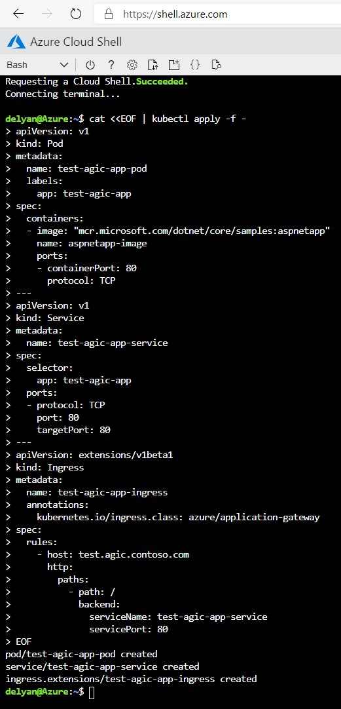
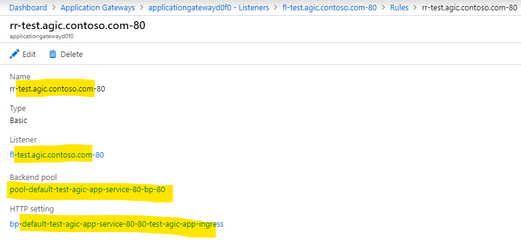
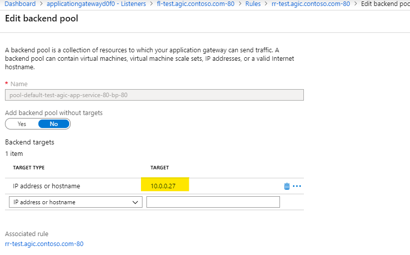
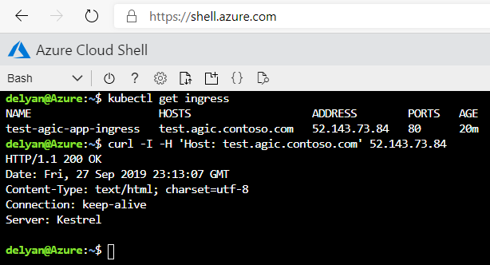

## Troubleshooting: Installing a simple application

[Azure Cloud Shell](https://shell.azure.com/) is the most convenient way to troubleshoot any problems with your AKS
and AGIC installation. Launch your shell from [shell.azure.com](https://shell.azure.com/) or by clicking the link:

[](https://shell.azure.com)

In the troubleshooting document, we will debug issues in the AGIC installation by installing a simple application step by step and check the output as we go along.  
The steps below assume:
  - You have an AKS cluster, with Advanced Networking enabled
  - AGIC has been installed on the AKS cluster
  - You already hav an App Gateway on a VNET shared with your AKS cluster

To verify that the App Gateway + AKS + AGIC installation is setup correctly, deploy
the simplest possible app:

```bash
cat <<EOF | kubectl apply -f -
apiVersion: v1
kind: Pod
metadata:
  name: test-agic-app-pod
  labels:
    app: test-agic-app
spec:
  containers:
  - image: "mcr.microsoft.com/dotnet/core/samples:aspnetapp"
    name: aspnetapp-image
    ports:
    - containerPort: 80
      protocol: TCP
---
apiVersion: v1
kind: Service
metadata:
  name: test-agic-app-service
spec:
  selector:
    app: test-agic-app
  ports:
  - protocol: TCP
    port: 80
    targetPort: 80
---
apiVersion: extensions/v1beta1
kind: Ingress
metadata:
  name: test-agic-app-ingress
  annotations:
    kubernetes.io/ingress.class: azure/application-gateway
spec:
  rules:
    - host: test.agic.contoso.com
      http:
        paths:
          - path: /
            backend:
              serviceName: test-agic-app-service
              servicePort: 80
EOF
```

Copy and paste all lines at once from the
script above into a [Azure Cloud Shell](https://shell.azure.com/). Please ensure the entire
command is copied - starting with `cat` and including the last `EOF`.



After a successful deployment of the app above your AKS cluster will have a new Pod, Service and an Ingress.

Get the list of pods with [Cloud Shell](https://shell.azure.com/): `kubectl get pods -o wide`.
We expect for a pod named 'test-agic-app-pod' to have been created. It will have an IP address. This address
must be within the VNET of the App Gateway, which is used with AKS.


Get the list of services: `kubectl get services -o wide`. We expect to see a service named
'test-agic-app-service'.


Get the list of the ingresses: `kubectl get ingress`. We expect an Ingress resource named
'test-agic-app-ingress' to have been created. The resource will have a host name 'test.agic.contoso.com'.


One of the pods will be AGIC. `kubectl get pods` will show a list of pods, one of which will begin
with 'ingress-azure'. Get all logs of that pod with `kubectl logs <name-of-ingress-controller-pod>`
to verify that we have had a successful deployment. A successful deployment would have added the following
lines to the log:
```
I0927 22:34:51.281437       1 process.go:156] Applied App Gateway config in 20.461335266s
I0927 22:34:51.281585       1 process.go:165] cache: Updated with latest applied config.
I0927 22:34:51.282342       1 process.go:171] END AppGateway deployment
```

Alternatively, from [Cloud Shell](https://shell.azure.com/) we can retrieve only the lines
indicating successful App Gateway configuration with
`kubectl logs <ingress-azure-....> | grep 'Applied App Gateway config in'`, where
`<ingress-azure....>` should be the exact name of the AGIC pod.

App Gateway will have the following configuration applied:

- Listener:


- Routing Rule:


- Backend Pool:
  - There will be one IP address in the backend address pool and it will match the IP address of the Pod we observed earlier with `kubectl get pods -o wide`



Finally we can use the `cURL` command from within [Cloud Shell](https://shell.azure.com/) to
establish an HTTP connection to the newly deployed app:

1. Use `kubectl get ingress` to get the Public IP address of App Gateway
2. Use `curl -I -H 'Host: test.agic.contoso.com' <publitc-ip-address-from-previous-command>`



A result of `HTTP/1.1 200 OK` indicates that the App Gateway + AKS + AGIC system is working as expected.


### Inspect Kubernetes Installation

#### Pods, Services, Ingress
Application Gateway Ingress Controller (AGIC) continuously monitors the following Kubernetes resources: [Deployment](https://kubernetes.io/docs/concepts/workloads/controllers/deployment/#creating-a-deployment) or [Pod](https://kubernetes.io/docs/concepts/workloads/pods/pod/#what-is-a-pod), [Service](https://kubernetes.io/docs/concepts/services-networking/service/), [Ingress](https://kubernetes.io/docs/concepts/services-networking/ingress/)


The following must be in place for AGIC to function as expected:
  1. AKS must have one or more healthy **pods**.
     Verify this from [Cloud Shell](https://shell.azure.com/) with `kubectl get pods -o wide --show-labels`
     If you have a Pod with an `apsnetapp`, your output may look like this:
     ```bash
     $> kubectl get pods -o wide --show-labels

     NAME                   READY   STATUS    RESTARTS   AGE   IP          NODE                       NOMINATED NODE   READINESS GATES   LABELS
     aspnetapp              1/1     Running   0          17h   10.0.0.6    aks-agentpool-35064155-1   <none>           <none>            app=aspnetapp
     ```

  2. One or more **services**, referencing the pods above via matching `selector` labels.
     Verify this from [Cloud Shell](https://shell.azure.com/) with `kubectl get services -o wide`
     ```bash
     $> kubectl get services -o wide --show-labels

     NAME                TYPE        CLUSTER-IP     EXTERNAL-IP   PORT(S)   AGE   SELECTOR        LABELS
     aspnetapp           ClusterIP   10.2.63.254    <none>        80/TCP    17h   app=aspnetapp   <none>     
     ```

  3. **Ingress**, annotated with `kubernetes.io/ingress.class: azure/application-gateway`, referencing the service above
     Verify this from [Cloud Shell](https://shell.azure.com/) with `kubectl get ingress -o wide --show-labels`
     ```bash
     $> kubectl get ingress -o wide --show-labels

     NAME        HOSTS   ADDRESS   PORTS   AGE   LABELS
     aspnetapp   *                 80      17h   <none>
     ```

  4. View annotations of the ingress above: `kubectl get ingress aspnetapp -o yaml` (substitute `aspnetapp` with the name of your ingress)
     ```bash
     $> kubectl get ingress aspnetapp -o yaml

     apiVersion: extensions/v1beta1
     kind: Ingress
     metadata:
       annotations:
         kubernetes.io/ingress.class: azure/application-gateway
       name: aspnetapp
     spec:
       backend:
         serviceName: aspnetapp
         servicePort: 80
     ```

     The ingress resource must be annotated with `kubernetes.io/ingress.class: azure/application-gateway`.
 

#### Verify Observed Nampespace

* Get the existing namespaces in Kubernetes cluster. What namespace is your app
running in? Is AGIC watching that namespace? Refer to the
[Multiple Namespace Support](../features/multiple-namespaces.md#enable-multiple-namespace-support)
documentation on how to properly configure observed namespaces.
    ```bash
    # What namespaces exist on your cluster
    kubectl get namespaces

    # What pods are currently running
    kubectl get pods --all-namespaces -o wide
    ```


* The AGIC pod should be in the `default` namespace (see column `NAMESPACE`). A healthy pod would have `Running` in the `STATUS` column. There should be at least one AGIC pod.
    ```bash
    # Get a list of the Application Gateway Ingress Controller pods
    kubectl get pods --all-namespaces --selector app=ingress-azure
    ```


* If the AGIC pod is not healthy (`STATUS` column from the command above is not `Running`):
  - get logs to understand why: `kubectl logs <pod-name>`
  - for the previous instance of the pod: `kubectl logs <pod-name> --previous`
  - describe the pod to get more context: `kubectl describe pod <pod-name>`


* Do you have a Kubernetes
[Service](https://kubernetes.io/docs/concepts/services-networking/service/) and
[Ingress](https://kubernetes.io/docs/concepts/services-networking/ingress/) resources?
    ```bash
    # Get all services across all namespaces
    kubectl get service --all-namespaces -o wide

    # Get all ingress resources across all namespaces
    kubectl get ingress --all-namespaces -o wide
    ```


* Is your [Ingress](https://kubernetes.io/docs/concepts/services-networking/ingress/) annotated with: `kubernetes.io/ingress.class: azure/application-gateway`? AGIC will only watch for Kubernetes Ingress resources that have this annotation.
    ```bash
    # Get the YAML definition of a particular ingress resource
    kubectl get ingress --namespace  <which-namespace?>  <which-ingress?>  -o yaml
    ```


* AGIC emits Kubernetes events for certain critical errors. You can view these:
  - in your terminal via `kubectl get events --sort-by=.metadata.creationTimestamp`
  - in your browser using the [Kubernetes Web UI (Dashboard)](https://kubernetes.io/docs/tasks/access-application-cluster/web-ui-dashboard/)
